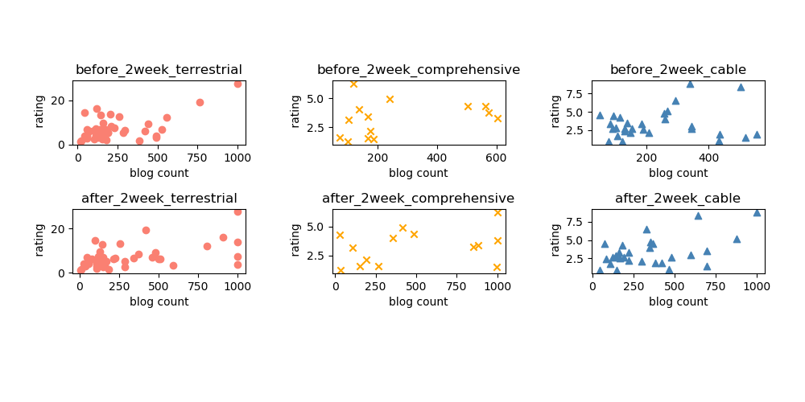

# Data_Crawling

## Description

- #### crawling_code

| 파일명                              | 요약                                                         |
| ----------------------------------- | ------------------------------------------------------------ |
| blog_post_crawling.py               | 검색한 드라마에 대한 블로그 포스트를 크롤링하는  파일        |
| blog_post_deduplication.py          | 중복된 블로그 포스트를 제거하는 파일                         |
| blog_post_remove_data.py            | 원하는 키워드가 들어있지 않은 포스트를 제거하는 파일         |
| drama_list_crawling.py              | 지상파, 종합편성, 케이블 각각의 드라마를 크롤링하는 파일     |
| drama_rating_average.py             | 크롤링한 드라마 시청률의 평균 시청률을 계산하는 파일         |
| drama_rating_naver_crawling.py      | 30 부작 이하의 드라마 시청률을 크롤링하는 파일 (네이버 검색) |
| drama_rating_naver_wiki_crawling.py | 30 부작 이상의 드라마 시청률을 크롤링하는 파일 (네이버 지식백과) |
| draw_figure.py                      | 데이터 분석 결과를 그려주고 상관계수를 계산하는 파일         |
| utils.py                            | 파일 리스트 읽기, 드라마 목록 읽기, csv 저장하기 등 반복하여 사용하게 되는 함수를 모아놓은 파일 |

- #### crawling_data

 > - blog_post

| 파일명                                   | 요약                                                         |
| ---------------------------------------- | ------------------------------------------------------------ |
| blog_post_after_2주_종합편성 (디렉토리)  | 종합편성 드라마 종영 후 2주간의 블로그 포스트 csv 파일 데이터 |
| blog_post_after_2주_지상파(디렉토리)     | 지상파 드라마 종영 후 2주간의 블로그 포스트 csv 파일 데이터  |
| blog_post_after_2주_케이블(디렉토리)     | 케이블 드라마 종영 후 2주간의 블로그 포스트 csv 파일 데이터  |
| blog_post_before_2주_종합편성 (디렉토리) | 종합편성 드라마 방영 시작 전 2주간의 블로그 포스트 csv 파일 데이터 |
| blog_post_before_2주_지상파(디렉토리)    | 지상파 드라마 방영 시작 전 2주간의 블로그 포스트 csv 파일 데이터 |
| blog_post_before_2주_케이블(디렉토리)    | 케이블 드라마 방영 시작 전 2주간의 블로그 포스트 csv 파일 데이터 |
| blog_post_count_after_2주_종합편성.csv   | 종합편성 드라마 종영 후 2주간의 블로그 포스트 개수 (중복 제거 전, 제거 후) |
| blog_post_count_after_2주_지상파.csv     | 지상파 드라마 종영 후 2주간의 블로그 포스트 개수 (중복 제거 전, 제거 후) |
| blog_post_count_after_2주_케이블.csv     | 케이블 드라마 종영 후 2주간의 블로그 포스트 개수 (중복 제거 전, 제거 후) |
| blog_post_count_before_2주_종합편성.csv  | 종합편성 드라마 방영 시작 전 2주간의 블로그 포스트 개수 (중복 제거 전, 제거 후) |
| blog_post_count_before_2주_지상파.csv    | 지상파 드라마 방영 시작 전 2주간의 블로그 포스트 개수 (중복 제거 전, 제거 후) |
| blog_post_count_before_2주_케이블.csv    | 케이블 드라마 방영 시작 전 2주간의 블로그 포스트 개수 (중복 제거 전, 제거 후) |

> - drama_list

| 파일명             | 요약                                     |
| ------------------ | ---------------------------------------- |
| drama_종합편성.csv | 크롤링 한 종합편성 드라마 데이터         |
| drama_지상파.csv   | 크롤링 한 지상파 드라마 데이터           |
| drama_케이블.csv   | 크롤링 한 케이블 드라마 데이터drama_list |

> - drama_rating

| 파일명                            | 요약                             |
| --------------------------------- | -------------------------------- |
| drama_rating_종합편성 (디렉토리)  | 종합편성 드라마 시청률 데이터    |
| drama_rating_지상파 (디렉토리)    | 지상파 드라마 시청률 데이터      |
| drama_rating_케이블 (디렉토리)    | 케이블 드라마 시청률 데이터      |
| drama_average_rating_종합편성.csv | 종합편성 각 드라마의 평균 시청률 |
| drama_average_rating_지상파.csv   | 지상파 각 드라마의 평균 시청률   |
| drama_average_rating_케이블.csv   | 케이블 각 드라마의 평균 시청률   |

 

## Result 

> - 시각화 

> -  피어슨 상관계수 

> 참고

|  상관계수  |      해석    |
| --------- | ---------------- |
| 0.0 ~ 0.2 | 상관관계 거의 없음 |
| 0.2 ~ 0.4 | 약한 상관관계 |
| 0.4 ~ 0.6 | 상관관계 있음 |
| 0.6 ~ 0.8 | 강한 상관관계 |
| 0.8 ~ 1.0 | 매우 강한 상관관계|

