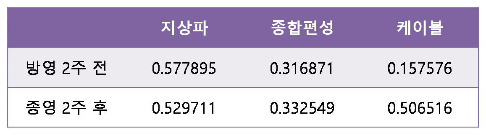

# Data_Crawling

# Description

- #### crawling_code

| 파일명                              | 요약                                                         |
| ----------------------------------- | ------------------------------------------------------------ |
| blog_post_crawling.py               | 검색한 드라마에 대한 블로그 포스트를 크롤링하는  파일        |
| blog_post_deduplication.py          | 중복된 블로그 포스트를 제거하는 파일                         |
| blog_post_remove_data.py            | 원하는 키워드가 들어있지 않은 포스트를 제거하는 파일         |
| drama_list_crawling.py              | 지상파, 종합편성, 케이블 각각의 드라마를 크롤링하는 파일     |
| drama_rating_average.py             | 크롤링한 드라마 시청률의 평균 시청률을 계산하는 파일         |
| drama_rating_naver_crawling.py      | 30 부작 이하의 드라마 시청률을 크롤링하는 파일 (네이버 검색) |
| drama_rating_naver_wiki_crawling.py | 30 부작 이상의 드라마 시청률을 크롤링하는 파일 (네이버 지식백과) |
| draw_figure.py                      | 데이터 분석 결과를 그려주고 상관계수를 계산하는 파일         |
| utils.py                            | 파일 리스트 읽기, 드라마 목록 읽기, csv 저장하기 등 반복하여 사용하게 되는 함수를 모아놓은 파일 |

# Result 

